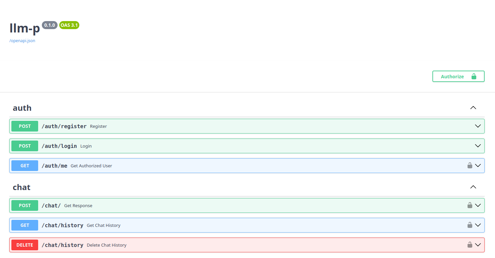
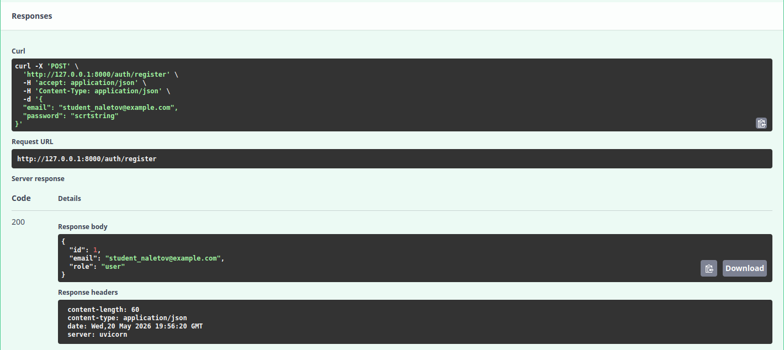
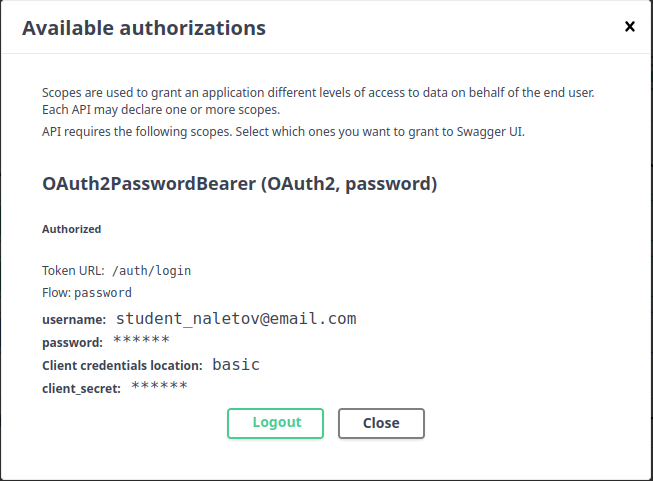
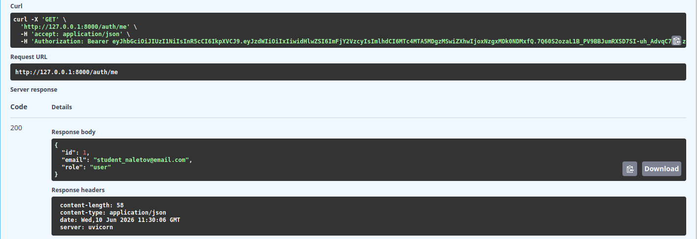
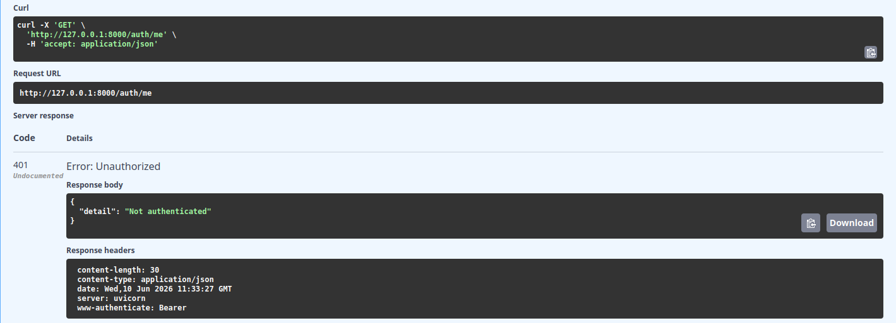
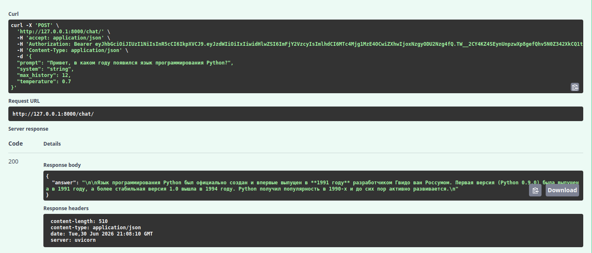
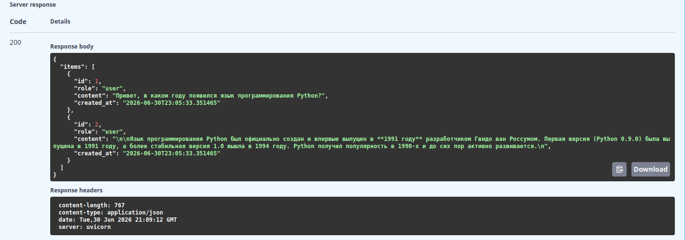
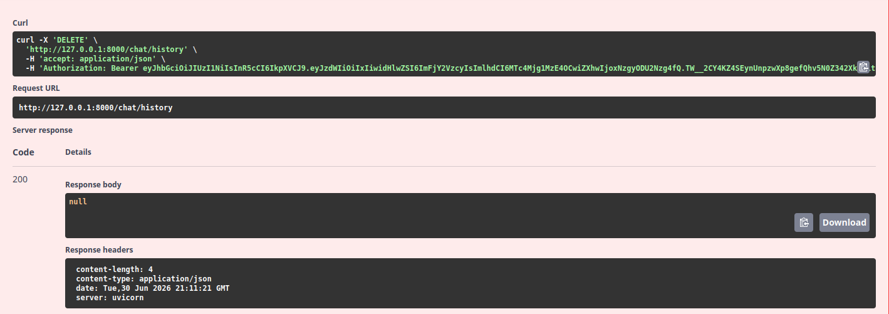

# Проект. Построение защищённого API для работы с большой языковой моделью

## Обзор
Целью данного проекта является разработка серверного приложения на FastAPI, предоставляющего защищённый API для взаимодействия с большой языковой моделью (LLM) через сервис OpenRouter.

## Рекомендации по установке и запуску
Приложение функционально на операционных системах GNU/Linux с версией ядра не ниже 6.16. Также будет не лишним владеть базовыми навыками работы с терминалом в Linux.

- Проверьте, что на вашей системе установлен интерпретатор Python с версией не ниже 3.11
  - Если версия вашего интерпретатора ниже, установите нужную версию в системе по инструкции в материале №3 раздела [Вспомогательные ссылки](#vspomogatelnye-ssylki). Не забудьте перейти на установленную версию!
- Скачайте архив и извлеките его содержимое в удобную вам папку
- В терминале откройте папку с файлами проекта
- Для установки приложения введите команду `uv pip install -r <(uv pip compile pyproject.toml)`
- Для запуска приложения введите команду `uv run uvicorn app.main:app --reload --host 0.0.0.0 --port 8000`

## Интерфейс

## Регистрация пользователя
- Пользователь приложения регистрируется в интерфейсе Swagger по ветке /auth/register (данные пользователя записываются во внутреннюю БД)

- При попытке регистрации пользователя с данными, уже имеющимися в БД, приложение выдаёт ошибку (код 409) с указанием на совпадающие данные

## Авторизация пользователя
- Пользователь приложения авторизуется через форму OAuth2 по кнопке Authorize, а приложение автоматически создаёт JWT токен на данную сессию

- При попытке авторизации пользователя с неверными данными приложение выдаёт соответствующую ошибку (код 401)

## Информация об активном пользователе
- Авторизованный пользователь приложения может просмотреть свои данные по ветке /auth/me

- При попытке просмотреть данные неавторизованного пользователя приложение выдаёт ошибку Not Found (код 404) и пробрасывает в интерфейс исключение Unauthorized

## Отправка сообщения для модели
- Пользователь создаёт запрос в форме и передаёт в чат с моделью от OpenRouter по ветке /chat

- При ошибке приложение выбрасывает доменную ошибку внешнего сервиса

## Вывод истории чата
- Пользователь может просмотреть историю чата с моделью по ветке /chat/history

## Удаление всей истории чата
- Если необходимо, пользователь может очистить историю данного чата по ветке /chat/history

## Вспомогательные ссылки
1. [Git](https://git-scm.com/)
2. [Основы Linux от создателя Gentoo. Часть 2 (2/5): Назначения папок, поиск файлов](https://habr.com/ru/articles/105495/)
3. [Установка нескольких версий Python на Ubuntu с помощью pyenv](https://itshaman.ru/news/linux/ustanovka-neskolkikh-versii-python-na-ubuntu-s-pomoshchyu-pyenv)
